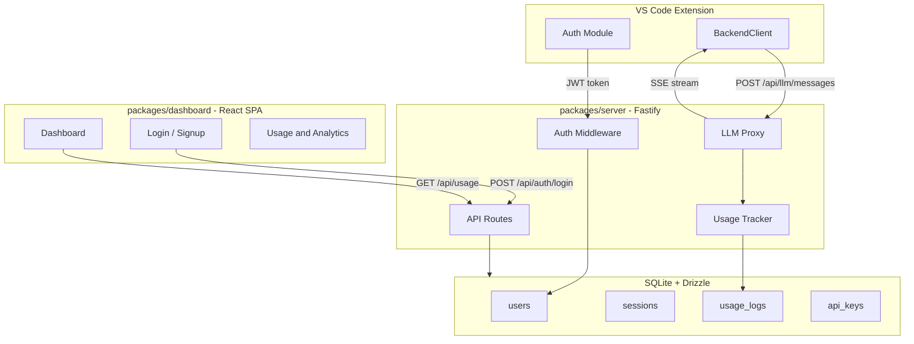
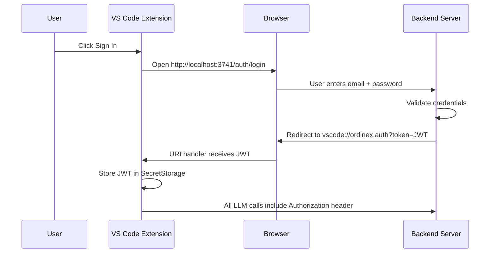

# A1: Backend Server + Auth + Web Dashboard

## Architecture Overview

## Auth Flow: Extension to Backend

Same pattern used by Cursor and Windsurf: extension opens browser for auth, browser redirects back via custom URI scheme.

---

## Phase 1: Server Foundation (A1.1)

New package: `packages/server/`

**Files to create:**

- `packages/server/package.json` -- deps: fastify, @fastify/cors, fastify-type-provider-zod, drizzle-orm, drizzle-libsql, @libsql/client, jose, bcrypt, zod
- `packages/server/tsconfig.json` -- extends root, target ES2022
- `packages/server/src/index.ts` -- Fastify app bootstrap, plugin registration, port 3741
- `packages/server/src/config.ts` -- env vars: PORT, JWT_SECRET, DB_PATH, ANTHROPIC_API_KEY
- `packages/server/src/plugins/cors.ts` -- @fastify/cors with vscode-webview:// + localhost origins
- `packages/server/src/plugins/auth.ts` -- JWT verification decorator
- `packages/server/src/plugins/zod.ts` -- fastify-type-provider-zod wiring (single Zod schema = validation + TypeScript types)

**Database schema (libsql embedded SQLite + Drizzle):**

- `packages/server/src/db/schema.ts`:
  - `users` -- id, email, password_hash, name, created_at, plan (free/pro/team)
  - `sessions` -- id, user_id, token_hash, expires_at, created_at
  - `api_keys` -- id, user_id, key_hash, name, last_used_at, created_at
  - `usage_logs` -- id, user_id, model, input_tokens, output_tokens, cost_cents, endpoint, created_at
- `packages/server/src/db/index.ts` -- Drizzle client (drizzle-libsql, async, embedded file mode) + migration runner
- `packages/server/drizzle.config.ts` -- migration config

---

## Phase 2: Authentication (A1.2)

**API routes** -- `packages/server/src/routes/auth.ts`:

- `POST /api/auth/signup` -- email, password, name -> create user, return JWT
- `POST /api/auth/login` -- email, password -> validate, return JWT
- `POST /api/auth/refresh` -- refresh token -> new JWT
- `GET /api/auth/me` -- current user profile
- `POST /api/auth/logout` -- invalidate session

**Auth utilities:**

- `packages/server/src/auth/jwt.ts` -- sign/verify with jose (HS256, 7d expiry)
- `packages/server/src/auth/password.ts` -- bcrypt hash/verify
- `packages/server/src/auth/middleware.ts` -- Fastify preHandler, validates Authorization: Bearer header

**Validation** -- `packages/server/src/schemas/auth.ts`: Zod schemas for signup and login. Used directly in Fastify route definitions via fastify-type-provider-zod (single schema = runtime validation + TypeScript types, no manual JSON Schema)

---

## Phase 3: LLM Proxy + SSE Streaming (A1.3)

All LLM calls go through the backend. Backend holds the Anthropic API key; users never see it.

**Routes** -- `packages/server/src/routes/llm.ts`:

- `POST /api/llm/messages` -- non-streaming, returns JSON
- `POST /api/llm/messages/stream` -- streaming, returns SSE

Both require auth, validate input via Zod, forward to Anthropic, log usage.

**Usage tracking** -- `packages/server/src/services/usageTracker.ts`:

- Logs every LLM call: user_id, model, input/output tokens, estimated cost, latency

---

## Phase 4: Web Dashboard (A1.4)

New package: `packages/dashboard/` -- React SPA bundled with Vite, served by Fastify.

**2 pages:**

1. **Auth Page** (`/auth`) -- login/signup toggle, email + password form
2. **Dashboard Page** (`/dashboard`):
  - Profile section -- name, email, plan tier
  - Subscription card -- current plan, upgrade placeholder
  - Usage analytics -- tokens this month, cost estimate, daily chart
  - API Keys -- list, create, revoke
  - Recent activity -- last 20 LLM calls

**Tech:** React 19, Vite, Tailwind CSS, recharts, react-router

---

## Phase 5: Extension Client Refactor (A1.5)

Replace ALL direct Anthropic SDK calls with backend proxy calls. Server is the only path to LLM access -- no BYOK, no direct API key input.

**New files:**

- `packages/extension/src/backendClient.ts` -- HTTP client for backend (auth + LLM calls)
- `packages/extension/src/backendLLMClient.ts` -- implements LLMClient interface, routes ALL calls through backend

**Modify:**

- `packages/extension/src/extension.ts` -- register vscode://ordinex.auth URI handler
- All 8 handler files (18 references to ordinex.apiKey) -- replace with backend auth check

**Delete:**

- `packages/extension/src/anthropicLLMClient.ts` -- no longer needed, server is the only LLM path
- Remove `@anthropic-ai/sdk` from extension dependencies (stays in server only)
- Remove all `ordinex.apiKey` SecretStorage usage -- replaced by JWT auth token

---

## Phase 6: Usage API + Dashboard Wiring (A1.6)

- `GET /api/usage/summary` -- current month totals
- `GET /api/usage/daily?days=30` -- daily breakdown
- `GET /api/usage/recent?limit=20` -- recent calls
- `GET/PUT /api/account/profile`
- `GET/POST/DELETE /api/account/keys`

---

## Key Decisions

- **Port 3741** -- unlikely to conflict
- **libsql (not better-sqlite3)** -- async API, no event-loop blocking (same principle as P2-3). Embedded file mode = zero infra. Turso cloud is a one-line config change later
- **Drizzle + drizzle-libsql** -- type-safe ORM, Postgres migration path via adapter swap
- **fastify-type-provider-zod** -- one Zod schema per route = runtime validation + TypeScript inference, no duplicate JSON Schema
- **@fastify/cors** -- from day one, with vscode-webview:// origin whitelisted (silent failures otherwise)
- **Server-only LLM access** -- no BYOK, no direct API keys. All users authenticate via server, use subscription credits. When credits run out, users purchase more (Cursor model). Extension has zero direct Anthropic SDK dependency
- **JWT in SecretStorage** -- replaces current API key storage entirely
- **Dashboard served by Fastify** -- single process
- **Stripe deferred** -- placeholder card, real usage tracking from day 1
- **Client-agnostic backend** -- REST + JWT architecture works for VS Code extension, future desktop app (Electron/Tauri), web, or mobile clients. No client-specific logic in the server

